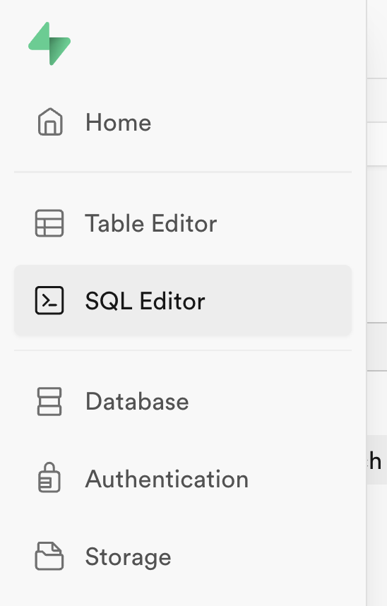
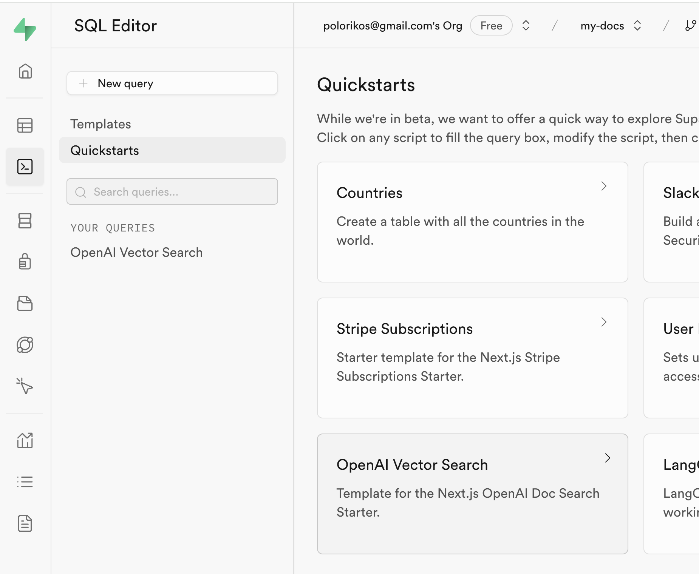
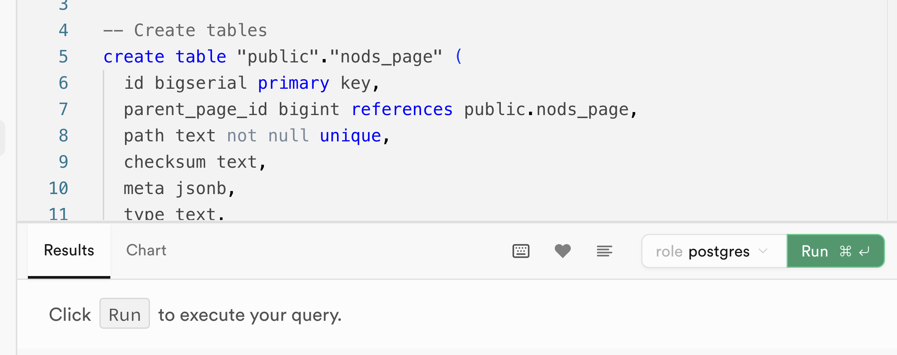
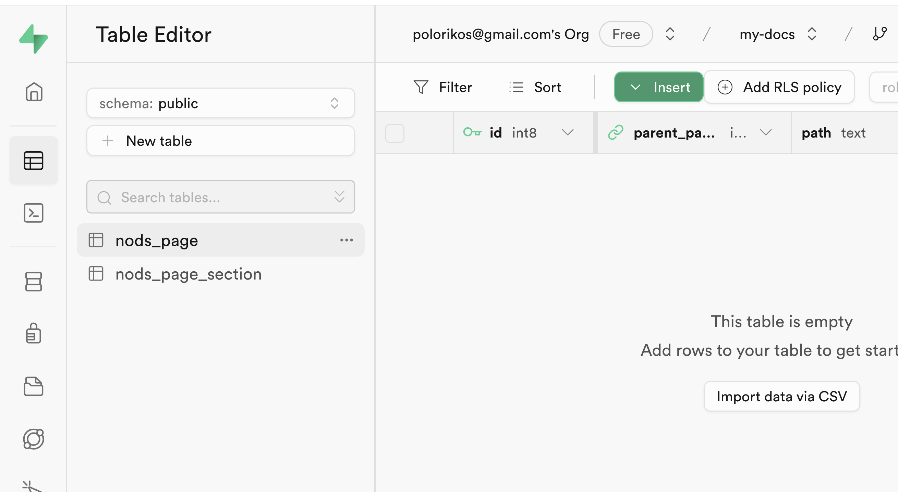

[previous step](STEP_00.md) | [next step](STEP_02.md)

---

# Chapter 2: Setting up Supabase

## Creating the database

_This is based on the [Supabase Vector search with Next.js and OpenAI](https://supabase.com/docs/guides/ai/examples/nextjs-vector-search) guide._

1. Go to your project's dashboard, and on the left side menu click on "SQL Editor":

   

2. Then, go to "Quickstarts" and click on the "OpenAI Vector Search" template:

   

3. Finally, click "Run" to execute your query:

   

This will create two new tables in your database, where we will store all the embeddings:

Now, we are ready to take a look at the embeddings code, and understand how it works!

---

[previous step](STEP_00.md) | [next step](STEP_02.md)
